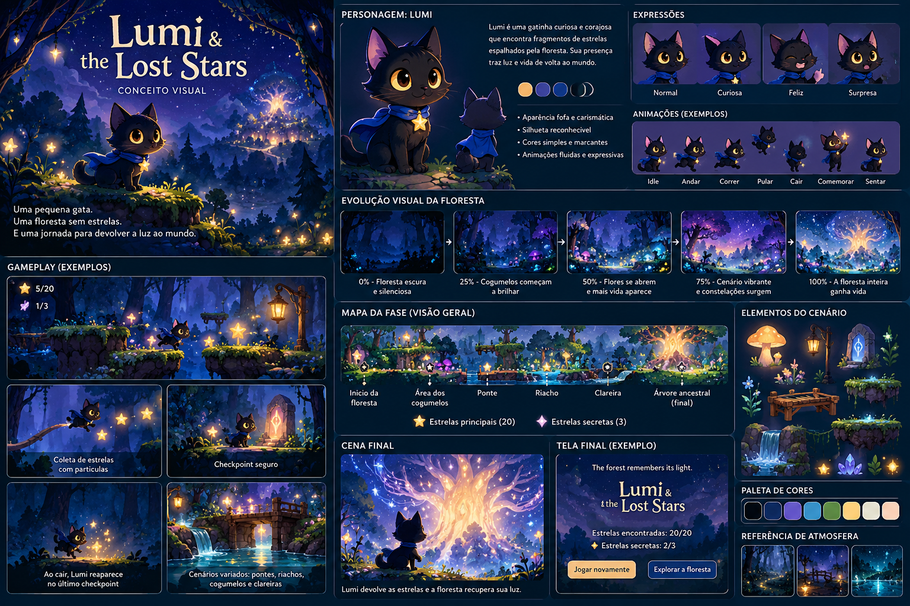

# Lumi & the Lost Stars

Jogo 2D cozy de plataforma, sem Game Over. Lumi recupera 20 estrelas principais e 3 secretas para devolver a luz à floresta.

**[Jogar no navegador](https://soubeatrizkaroline.github.io/Lumi_Game/)**

## Revisão jogável

A simulação agora é independente do desenho e avança em passos fixos de 1/120 s. As plataformas suspensas são atravessáveis por baixo: Lumi pousa em seu topo, sem prender a cabeça ou esbarrar nas laterais. O terreno e a ponte são sólidos. O percurso tem chão seguro e saltos com margem; as superfícies decorativas do fundo antigo não são apresentadas como plataformas.

A personagem usa animação contínua desenhada em Canvas, com proporções constantes, passada ligada ao deslocamento, cauda, lenço, piscadas e compressão ao pousar. A antiga folha de oito poses inconsistentes não é carregada. O fundo ilustrado é recortado para o plano distante e seu desfoque é calculado uma única vez; objetos distantes fora da câmera não recebem efeitos luminosos.

## Controles

| Ação | Teclado | Celular |
| --- | --- | --- |
| Andar | A/D ou ←/→ | Botões direcionais |
| Pular | Espaço, W ou ↑ | Botão de pulo |
| Salto alto | Segurar o pulo | Segurar o botão |
| Descer de plataforma | S/↓ + pulo | Descer + pulo |
| Voltar ao checkpoint | R | Pausar e recomeçar reinicia a partida inteira |
| Pausar/continuar | Escape ou botão | Botão Pausar |

Botões touch aceitam movimento e salto simultâneos. Ao sair da aba ou perder o foco, a partida pausa e apresenta **Continuar**, evitando movimento preso ou uma pausa invisível.

## Mecânicas

- Aceleração e frenagem suaves, salto de altura variável, coyote time de 120 ms e jump buffer de 150 ms.
- 20 plataformas e estrelas principais; três estrelas violetas alcançáveis com saltos extras.
- Quatro pontos seguros, ativados ao passar perto deles no chão. Retornar preserva as estrelas.
- Ponte contínua sobre o riacho, cogumelos, parallax, água, partículas e Árvore Ancestral.
- Mudanças de paleta e brilho a cada cinco estrelas: 0%, 25%, 50%, 75% e 100%.
- Final na árvore após obter as 20 principais: **The forest remembers its light.** As secretas são opcionais; é possível continuar explorando após o final.
- Sons opcionais (desligados inicialmente), movimento reduzido respeitando a preferência do sistema e alto contraste no menu de pausa.

## Executar localmente

Não há instalação de dependências nem etapa de build. Abra `index.html` no navegador ou, com Python instalado, execute na pasta do projeto:

```sh
python -m http.server 8080
```

Abra `http://localhost:8080`. Para testes, é necessário Node.js:

```sh
node core.test.cjs
```

Os testes usam a mesma simulação da página. Um agente de teste anda e pula pela rota inteira, pousa nas 20 plataformas, coleta 20+3 estrelas e chega ao final sem teletransportar a personagem. Outros casos verificam salto curto/alto, coyote time, buffer, descida, respawn e travessia da ponte. Isso verifica a lógica, não substitui avaliação visual nem garante uma taxa de quadros em todos os celulares.

## Estrutura

| Arquivo | Responsabilidade |
| --- | --- |
| `core.js` | Mapa, física determinística, colisões, coleta, checkpoints e final |
| `renderer.js` | Personagem, cenário, câmera e partículas |
| `game.js` | Entrada, passo fixo, interface, pausa e áudio |
| `core.test.cjs` | Percurso completo e regressões da simulação |
| `index.html`, `style.css` | Interface responsiva e controles acessíveis |
| `forest-art.png` | Ilustração de fundo distante |
| `reference-lumi-concept.png` | Referência visual original |
| `lumi-spritesheet.png` | Estudo visual anterior, não usado em execução |

## Direção visual e limitações



A prancha orienta cores, personagem e atmosfera; a arte atual em Canvas é uma interpretação simplificada, não uma reprodução da ilustração. Esta revisão prioriza controle previsível e legibilidade. Não há salvamento entre sessões, navegação completa por leitor de tela nem validação de desempenho em aparelhos móveis físicos.

## Publicação e roadmap

O GitHub Actions executa os testes e publica no GitHub Pages em cada push para `main`. Uma falha nos testes impede a publicação.

Próximas melhorias: sprites finais com pivôs consistentes; plataformas com arte pintada sem alterar seus colisores; rotas secretas menos lineares; trilha ambiente; salvamento; testes em dispositivos físicos e ampliação de acessibilidade.

## Licença

MIT. Consulte `LICENSE`.
